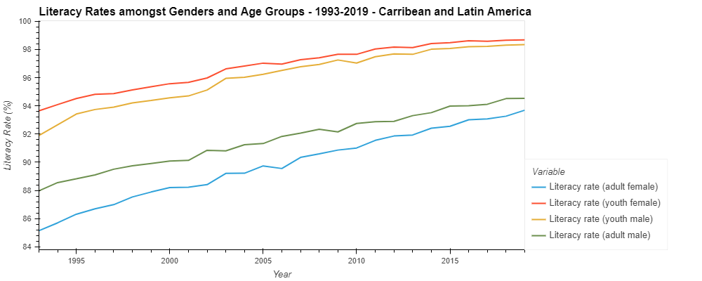
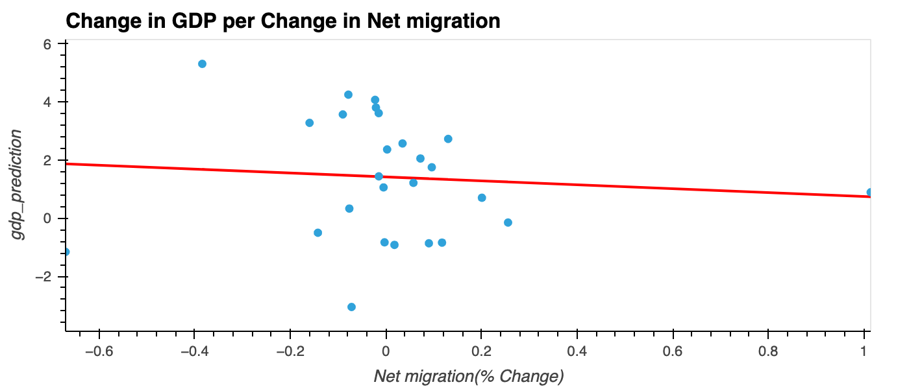

# Determinants of GDP

## Project Description

This project aims to analyze the impact of social and economic factors, using econometric and machine learning models, on GDP growth rate per capita. We used the World Bank Open Data to obtain data on various social and economic metrics on the Latin America and Caribbean region.  We studied the impact of these factors on economic growth (GDP growth rate per capita) from 1993 to 2019. Additionally, we used the econometric and machine learning models to forecast future gdp growth rate per capita.  

## Background

Social factors like increased access to electricity, literacy rate or primary school enrollment can have a significant impact on the economic development of a country or region; however, it can prove challenging to quantify the specific economic impact of these socail factors. Our study aims to quantify the impact of these social factors on the economic development in the Latin America and Caribbean regions, measured using the proxy variable of GDP growth rate per capita. We hypothesize that growth in these factors will have a positive impact on the economic development of the Latin America region. Other studies and literature on this topic support a similar opinion. For example,  Gerry Gatawa, in his paper *The Effect of Social Factors to Economic Growth*1, said that "Social factors are great drivers of economic growth and it could result to tangible benefits that can trigger sustainable development". Gatawa's "study calls for a paradigm shift among economists, public administrators, and finance managers to view social expenditures as investments that could guarantee sustainable economic growth and development"1.     

## Notebooks

Multi-Variable Linear Regression Analysis

Neural-Multi Layer Perceptron Regression Analysis

Data Visualization

Regression Visual

## Data

### Dependent Variable:

* **GDP per Capita Growth (Annual %):**
Annual percentage growth rate of GDP per capita based on constant local currency. GDP per capita is the gross domestic product divided by the midyear population. We are using GDP at purchaser's prices, which is the sum of the gross value added by all resident producers in the economy, plus any product taxes and minus any subsidies not included in the value of the products. It is calculated without making deductions for depreciation of fabricated assets, or for depletion and degradation of natural resources.

### Independent Variables:

* **Access to Electricity (% of Population):**
This variable is measured as the percentage of the population with access to electricity. Electrification data are collected from industry, national surveys and international sources.

* **Labor Force Participation Rate(% of Population - National Estimate):**
Labor force participation rate is the proportion of the population that is economically active: all people who supply labor for the production of goods and services during a specified period. For our dataset, we will be including males/females (15-24 years old). Each variation will have its own data, meaning that we have two different independent variables for Labor Force Participation Rate.

* **Literacy Rate (% of Population):**
Literacy rate is the percentage of people within our measured population who can both read and write, while understanding a short simple statement about their everyday life. For our dataset, we will be including youth males/females (15-24 years old), and adult males/females (15 years and older). Each variation will have its own data, meaning that we have four different independent variables for Literacy Rate.

* **Life Expectancy at Birth (Years):**
Life expectancy at birth indicates the number of years a newborn infant would live, if prevailing patterns of mortality at the time of its birth were to stay the same throughout its life. For our dataset, we will be including males and females. Each variation will have its own data, meaning that we have two different independent variables for Life Expectancy at Birth.

* **Net Migration (Persons):**
This variable is the measure of the net total of migrants during the period; The number of immigrants minus the number of emigrants, including both citizens and noncitizens.

* **School Enrollment, Primary (% Net):**
Net enrollment rate is the ratio of children of official school age who are enrolled in school to the population of the corresponding official school age. Primary education provides children with basic reading, writing, and mathematics skills along with an elementary understanding of such subjects as history, geography, natural science, social science, art, and music.

## Data Trends

### Dependent Variable:

* **GDP per Capita Growth (Annual %):**

### Independent Variables:

* **Access to Electricity (% of Population):**

 

* Regression analysis:

 

  

 

Model's slope: [151.87261585] 
Model's y-intercept: 0.8631600543704548 
Model's formula: y = 0.8631600543704548 + 151.87261584994744X 
The score is 0.1399342267424475. 
The r2 is 0.1399342267424475. 
The mean squared error is 3.6190901860729765. 
The root mean squared error is 1.9023906502274912. 
The standard deviation is 2.0513221536981656.

 

* Partial Dependence:

 

 

* **Labor Force Participation Rate(% of Population - National Estimate):**

 

* Regression analysis:

 

 

Model's slope: **[-59.2568929]** 
Model's y-intercept: **0.9879903478885705** 
Model's formula: **y = 0.9879903478885705 + -59.256892899183754X**  
The score is **0.081955968304525.** 
The r2 is **0.081955968304525.** 
The mean squared error is **3.863058208801691.** 
The root mean squared error is **1.96546640999069.** 
The standard deviation is **2.0513221536981656.**

 

 

Model's slope: **[-39.88229024]**  
Model's y-intercept: **1.4728262008369282**  
Model's formula: **y = 1.4728262008369282 + -39.88229023843679X**  
The score is **0.10404919504853216.**  
The r2 is **0.10404919504853216.**  
The mean squared error is **3.770091621159123.**  
The root mean squared error is **1.941672377400246.**  
The standard deviation is **2.0513221536981656.**

 

* Partial Dependence:

 

 

* **Literacy Rate (% of Population):**

 

* Regression analysis:

 

.png)

 

Model's slope: **[-12.07106776]** 
Model's y-intercept: **1.4579617005095065** 
Model's formula: **y = 1.4579617005095065 + -12.071067757769967X** 
The score is **0.0002501179920167962.** 
The r2 is **0.0002501179920167962.** 
The mean squared error is **4.206870101107045.** 
The root mean squared error is **2.051065601366042.** 
The standard deviation is **2.0513221536981656.**

 

.png)

 

Model's slope: **[-101.02885127]** 
Model's y-intercept: **1.6174049048627688** 
Model's formula: **y = 1.6174049048627688 + -101.02885127028293X** 
The score is **0.007493030966136072.** 
The r2 is **0.007493030966136072.** 
The mean squared error is **4.176392484070927.** 
The root mean squared error is **2.043622392730841.** 
The standard deviation is **2.0513221536981656.**

 

.png)

 

Model's slope: **[387.96196296]** 
Model's y-intercept: **0.3363629579320879** 
Model's formula: **y = 0.3363629579320879 + 387.9619629559068X** 
The score is **0.20516871317406693.** 
The r2 is **0.20516871317406693.** 
The mean squared error is **3.3445885177366343.** 
The root mean squared error is **1.8288216199883012.** 
The standard deviation is **2.0513221536981656.**

 

.png)

 

Model's slope: **[-95.3044639]** 
Model's y-intercept: **1.6622822767176024** 
Model's formula: **y = 1.6622822767176024 + -95.30446390445971X** 
The score is **0.014062491327169191.** 
The r2 is **0.014062491327169191.** 
The mean squared error is **4.148748703490799.** 
The root mean squared error is **2.03684773694324.** 
The standard deviation is **2.0513221536981656.**

 

* Partial Dependence:

 

 

* **Life Expectancy at Birth (Years):**

 

* Regression analysis:

 

.png)

 

Model's slope: **[31.79087103]** 
Model's y-intercept: **1.3136965299408** 
Model's formula: **y = 1.3136965299408 + 31.790871029416955X** 
The score is **0.0008148183506124784.** 
The r2 is **0.0008148183506124784.** 
The mean squared error is **4.204493885718162.** 
The root mean squared error is **2.0504862559203274.** 
The standard deviation is **2.0513221536981656.**

 

.png)

 

Model's slope: **[112.7460223]** 
Model's y-intercept: **1.021490832853023** 
Model's formula: **y = 1.021490832853023 + 112.7460223039964X** 
The score is **0.012590121433568746.** 
The r2 is **0.012590121433568746.** 
The mean squared error is **4.15494432200962.** 
The root mean squared error is **2.0383680536178006.** 
The standard deviation is **2.0513221536981656.**

 

* Partial Dependence:

 

 

* **Net Migration (Persons):**

 

* Regression analysis:

 

 

Model's slope: **[-0.67247315]** 
Model's y-intercept: **1.422048932085808** 
Model's formula: **y = 1.422048932085808 + -0.6724731526630172X** 
The score is **0.007678319194034167**.** 
The r2 is **0.007678319194034167.** 
The mean squared error is **4.17561280555327.** 
The root mean squared error is **2.043431624878423.** 
The standard deviation is **2.0513221536981656.**

 

* Partial Dependence:

 

 

* **School Enrollment, Primary (% Net):**

 

* Regression analysis:

 

 

Model's slope: **[-40.19203328]** 
Model's y-intercept: **1.4479582305820913** 
Model's formula: **y = 1.4479582305820913 + -40.19203328002642X** 
The score is **0.017869620284637677.** 
The r2 is **0.017869620284637677.** 
The mean squared error is **4.132728599592347.** 
The root mean squared error is **2.0329113604858295.** 
The standard deviation is **2.0513221536981656.**

 

* Partial Dependence:

 

 

### Variable Correlation 

## Models

**Multi-Variable Linear Regression:**

GDP Growth Rate Per Capita(%) = 
                                𝛽0 + 𝛽1 [Access to Electricity] + 𝛽2 [Literacy Rate(Adult Female)] + 𝛽3 [Literacy Rate(Youth Female)] + 
                                𝛽4 [Literacy Rate(Adult Male)] + 𝛽5 [Literacy Rate(Youth Male)] + 𝛽6 [Life expectancy at Birth(Female)] + 
                                𝛽7 [Life expectancy at Birth(Male)] + 𝛽8 [Primary School Enrollment] + 𝛽9 [Labor Force Participation (Female)] + 
                                𝛽10 [Labor Force Participation (Male)] + 𝛽11 [Net Migration] + 𝜎t + g + 𝜖j,t,g                      

**Neural Networks (Supervised Learning)**

### Structure:  
    Number of Inputs: 12
    Hidden Layers:
    - 1: 24 Nodes
    - 2: 24 Nodes
    - 3: 24 Nodes
    Output Layer: 1   
    Activation Function: Linear (f(x)) 

### Where:
    i1 = Time  
    i2 = Access to Electricity  
    i3 = Literacy Rate (Adult Female)  
    i4 = Literacy Rate (Youth Female)  
    i5 = Literacy Rate (Adult Male)  
    i6 = Literacy Rate (Youth Male)  
    i7 = Life expectancy at Birth (Female)  
    i8 = Life expectancy at Birth (Male)  
    i9 = Primary School Enrollment  
    i10 = Labor Force Participation (Female)  
    i11 = Labor Force Participation (Male)  
    i12 = Net Migration  

### Diagram:

<<<<<<< HEAD

## Results and Next Steps

The Multi-Variable Linear Regression and Mulit-Layer Perceptron Regression modes have low model scores signifying low model predictability. The models also have low  R S-Squared values signifying that the Independent variables do not explain the dependent variable well. The poor explainability relationship between the variables, in the model, could be explained by the Social factors not having a significant impact on Economic Development. However, given that results from studies and economic development theory suggest the opposite, we believe that models and data sets need to be further refined to better analyze the impact of Socail factors on Economic Development.

Additionally, the Latin America and Caribbean regions display high Social development. For instance the literacy rates, and labor force participation are very high. Therefore, these factors are past the critical point where as additional increase would result in a proprtional impact on economiic developemnt. However, regions with low Social Development, would have social factors that  might exhibit a higher correlation with economic development. As a next step, other regions in the world, particularly regions with low development, should be studid to better undersand the impact of the Scial Factors on Ecnomic Development. 

Furthermore, a dataset that covers a lager time horizon should be used. Due to the difficultes with collecting data on Social Factors, we could only use data from 1993 onwards. Additional data sources should be investigated for further analysis. 

Finally, a variety of other variables serving as prozies of r social development should be used to identify the best variables for this study. Social development is multi faceted and cannot be easily captured using a discrete set of variables. By using different sets of social factor variables, the quality of the analysis can be improved. 
=======
## Results 
>>>>>>> 9315d487dc3bb4ee2e53ab52ec9c808980484e80

The Mulit-Layer Perceptron regressen has an R-Squared Score of 0.066. Meaning that the the indipendent variables also do not explain the dependent variable particularly well. That said, the neural network structure outlined above does produce far more models with positive R-Squared values than alternative designs. Dispite this tendancy, the model does has similar metrics to linear regression and suffers a similar lack of explainability. While a more capable Neural Network could certainly be created using better data and design, We believe that it is inappropriate for our purposes here and suggest alternative models be explored.

## Libraries

* Python
* Pandas
* Numpy
* Scikit Learn
* Conda
* Hvplot
* Matplotlib
* DateTime

## *Authors*:
- **Brandon Latherow** - [LinkedIn](https://www.linkedin.com/in/brandon-latherow-4703a9214/) | [Github](https://github.com/brandonlatherow)
- **Samuel Farrell** - [LinkedIn](https://www.linkedin.com/in/samuelcfarrell/) | [Github](https://github.com/SamCFarrell)
- **Sami Naeem** - [LinkedIn](https://www.linkedin.com/in/sami-naeem/) | [Github](https://github.com/SZun)

## References 

1) GATAWA, GERRY (2022): The Effect of Social Factors to Economic Growth. Advance. Preprint. https://doi.org/10.31124/advance.19397081.v1 

